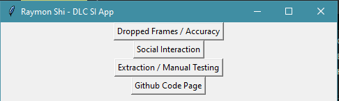
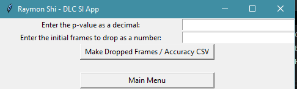
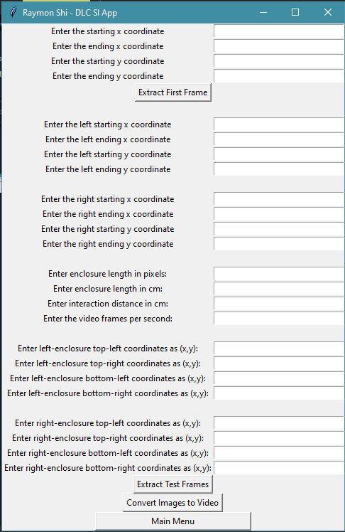

# deeplabcut-social-interaction

This is an application that cleans and wrangles the output from DeepLabCut and produces a CSV file containing information about rodent social interaction test. There is also a feature that allows for live video analysis of social interaction test. The application is adapted to the Eisch Lab's rodent social interaction protocol in which they perform a SI test on two mice within 1 trial (left and right mouse). 

The original model was trained on 200 frames that spanned across 4 videos. The model was trained for 200,000 iterations and has around a 95% accuracy.

This project was inspired by papers such as [Nagai, M., Nagai, H., Numa, C. et al. "Stress-induced sleep-like inactivity modulates stress susceptibility in mice"](https://www.nature.com/articles/s41598-020-76717-8?proof=t#citeas) and [Worley, Nicholas B., et al. “Deeplabcut Analysis of Social Novelty Preference.”](https://www.biorxiv.org/content/10.1101/736983v1)

## Some Pictures of the Application
  
  
 

## Modules
```
cv2
cvzone
glob
math
literal_eval
numpy
os
pandas
re
tkinter
tkinter.filedialog
webbrowser
```

## Installation
```
pip install opencv-python
pip install cvzone
pip install pandas
pip install numpy
pip install webbrowser
```

## Files
### main.py
```
The main file that gets ran. Creates the GUI and calls on the other files for functions.
```
### accuracy.py
```
This file calculates the accuracy of the model on the video by calculating the amount of dropped frames in the video.
```
### social_interaction.py
```
This file produces a CSV that contains empirical information about the social interaction test, such as sniffle count 
and sniffle time in seconds.
```
### extract_frames.py
```
This file extracts frames in the video to use as a reference and also produces a test video that shows live analysis 
of social interaction results.
```
